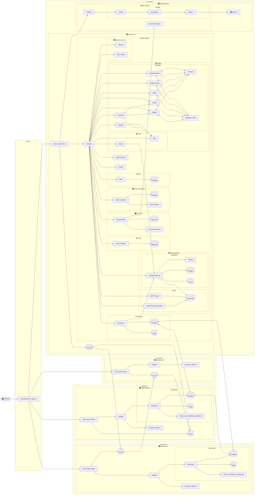

```mermaid
flowchart LR
    INTERNET(["fa:fa-cloud Internet"])

    INTERNET-->LB
    subgraph cloud
        LB["Load Balancer / Ingress"]
    end
    LB-->DOA_K8S_CONTROL_PLANE
    LB-->JOSH_K8S_CONTROL_PLANE
    LB-->SHEOL_K8S_CONTROL_PLANE
    LB-->EDGAR_K8S_CONTROL_PLANE

    subgraph oc_north_1 ["oc-north-1"]
        subgraph doa_server [fa:fa-server doa-server]
            DOA_K8S_CONTROL_PLANE["K8s Control Plane"]
            DOA_K8S_ETCD[("ETCD")]
            DOA_K8S_CONTROL_PLANE-->DOA_K8S_ETCD

            subgraph doa_server_worker ["Worker Node"]
                DOA_SERVER_KUBELET["Kubelet"]

                subgraph doa_authentication ["fa:fa-key Authentication"]
                    subgraph doa_ldap ["LDAP"]
                        DOA_OPENLDAP[("openLDAP")]
                        DOA_LAM["LDAP Account Manager"]
                        click DOA_LAM "https://lam.orleans.io"
                        DOA_LDAP_CHERRY["LDAP Cherry"]
                        click DOA_LDAP_CHERRY "https://account.orleans.io"

                        DOA_LAM-->DOA_OPENLDAP
                        DOA_LDAP_CHERRY-->DOA_OPENLDAP
                    end
                    subgraph doa_authentik ["Authentik"]
                        DOA_AUTHENTIK_SERVER["Authentik Server"]
                        click DOA_AUTHENTIK_SERVER "https://identity.orleans.io"
                        DOA_AUTHENTIK_WORKER["Worker"]
                        DOA_AUTHENTIK_DB[("Postgres")]
                        DOA_AUTHENTIK_CACHE[("Cache")]

                        DOA_AUTHENTIK_SERVER-->DOA_AUTHENTIK_WORKER
                        DOA_AUTHENTIK_SERVER-->DOA_AUTHENTIK_DB
                        DOA_AUTHENTIK_SERVER-->DOA_AUTHENTIK_CACHE
                    end

                    DOA_AUTHENTIK_SERVER-->DOA_OPENLDAP
                end
                DOA_SERVER_KUBELET-->DOA_LAM
                DOA_SERVER_KUBELET-->DOA_LDAP_CHERRY
                DOA_SERVER_KUBELET-->DOA_AUTHENTIK_SERVER

                subgraph doa_unifi ["fa:fa-wifi Unifi"]
                    DOA_UNIFI_CONTROLLER["Unifi Controller"]
                    click DOA_UNIFI_CONTROLLER "https://unifi.oc.orleans.io"
                    DOA_UNIFI_DB[("MongoDB")]

                    DOA_UNIFI_CONTROLLER-->DOA_UNIFI_DB
                end
                DOA_SERVER_KUBELET-->DOA_UNIFI_CONTROLLER

                subgraph doa_scrutiny ["fa:fa-hdd Scrutiny"]
                    DOA_SCRUTINY_WEB["Scrutiny Web"]
                    click DOA_SCRUTINY_WEB "https://scrutiny.orleans.io"
                    DOA_SCRUTINY_DB[("Influx DB")]
                    DOA_SERVER_SCRUTINY_COLLECTOR["Scrutiny Collector"]

                    DOA_SCRUTINY_WEB-->DOA_SCRUTINY_DB
                    DOA_SCRUTINY_WEB---DOA_SERVER_SCRUTINY_COLLECTOR
                end
                DOA_SERVER_KUBELET-->DOA_SCRUTINY_WEB

                DOA_UPTIME_KUMA["Uptime Kuma"]
                click DOA_UPTIME_KUMA "https://status.orleans.io"
                DOA_SERVER_KUBELET-->DOA_UPTIME_KUMA

                DOA_PIHOLE["Pi-hole"]
                click DOA_PIHOLE "https://pihole.oc.orleans.io"
                DOA_SERVER_KUBELET-->DOA_PIHOLE

                subgraph doa_nextcloud ["Nextcloud"]
                    DOA_NEXTCLOUD["Nextcloud"]
                    click DOA_NEXTCLOUD "https://drive.orleans.io"
                    DOA_NEXTCLOUD_DB[("Postgres")]
                    DOA_NEXTCLOUD_CACHE[("Redis")]

                    DOA_NEXTCLOUD-->DOA_NEXTCLOUD_DB
                    DOA_NEXTCLOUD-->DOA_NEXTCLOUD_CACHE
                    DOA_NEXTCLOUD-->DOA_AUTHENTIK_SERVER
                end
                DOA_SERVER_KUBELET-->DOA_NEXTCLOUD

                subgraph doa_home_assistant ["fa:fa-home Home Assistant"]
                    DOA_HASS["Home Assistant"]
                    click DOA_HASS "https://hass.oc.orleans.io"
                    DOA_HASS_DB[("Postgres")]
                    DOA_MQTT_BROKER["MQTT Broker"]

                    DOA_HASS-->DOA_HASS_DB
                    DOA_HASS-->DOA_MQTT_BROKER
                end
                DOA_SERVER_KUBELET-->DOA_HASS

                subgraph doa_wikijs ["WikiJS"]
                    DOA_WIKI["Wiki"]
                    click DOA_WIKI "https://kb.orleans.io"
                    DOA_WIKI_DB[("Postgres")]

                    DOA_WIKI-->DOA_WIKI_DB
                end
                DOA_SERVER_KUBELET-->DOA_WIKI

                subgraph doa_media ["fa:fa-music Media"]
                    subgraph doa_media_view ["fa:fa-play View"]
                        DOA_PLEX["Plex"]
                        click DOA_PLEX "https://plex.orleans.io"
                        DOA_KAVITA["Kavita"]
                        click DOA_KAVITA "https://books.orleans.io"
                        DOA_KAVITA-->DOA_AUTHENTIK_SERVER
                    end

                    subgraph doa_media_manage ["Manage"]
                        DOA_TAUTULLI["Tautulli"]
                        click DOA_TAUTULLI "https://tautulli.orleans.io"
                        DOA_OVERSEER["Overseer"]
                        click DOA_OVERSEER "https://requests.orleans.io"
                        DOA_RADARR["Radarr"]
                        click DOA_RADARR "https://radarr.oc.orleans.io"
                        DOA_SONARR["Sonarr"]
                        click DOA_SONARR "https://sonarr.oc.orleans.io"
                        DOA_LIDARR["Lidarr"]
                        click DOA_LIDARR "https://lidarr.oc.orleans.io"
                        DOA_READARR_AUDIO["Readarr Audio"]
                        click DOA_READARR_AUDIO "https://readarr.oc.orleans.io"
                        DOA_READARR_EBOOK["Readarr Ebook"]
                        click DOA_READARR_EBOOK "https://readarr-ebooks.oc.orleans.io"
                        DOA_PROWLARR["Prowlarr"]
                        DOA_DELUGE_VPN["Deluge in VPN"]
                        click DOA_DELUGE_VPN "https://bt.oc.orleans.io"

                        DOA_OVERSEER-->DOA_RADARR
                        DOA_OVERSEER-->DOA_SONARR
                        DOA_OVERSEER-->DOA_PLEX
                        DOA_TAUTULLI-->DOA_PLEX

                        DOA_RADARR<-->DOA_DELUGE_VPN
                        DOA_RADARR<-->DOA_PROWLARR
                        DOA_SONARR<-->DOA_DELUGE_VPN
                        DOA_SONARR<-->DOA_PROWLARR
                        DOA_LIDARR<-->DOA_DELUGE_VPN
                        DOA_LIDARR<-->DOA_PROWLARR
                        DOA_READARR_AUDIO<-->DOA_DELUGE_VPN
                        DOA_READARR_AUDIO<-->DOA_PROWLARR
                        DOA_READARR_EBOOK<-->DOA_DELUGE_VPN
                        DOA_READARR_EBOOK<-->DOA_PROWLARR
                    end
                end
                DOA_SERVER_KUBELET-->DOA_PLEX
                DOA_SERVER_KUBELET-->DOA_KAVITA
                DOA_SERVER_KUBELET-->DOA_OVERSEER
                DOA_SERVER_KUBELET-->DOA_TAUTULLI
                DOA_SERVER_KUBELET-->DOA_RADARR
                DOA_SERVER_KUBELET-->DOA_SONARR
                DOA_SERVER_KUBELET-->DOA_LIDARR
                DOA_SERVER_KUBELET-->DOA_READARR_AUDIO
                DOA_SERVER_KUBELET-->DOA_READARR_EBOOK

                subgraph doa_game_servers ["fa:fa-gamepad Game Servers"]
                    DOA_VALHEIM["Valheim"]
                    DOA_DCS["DCS: World"]
                end
                DOA_SERVER_KUBELET-->DOA_VALHEIM
                DOA_SERVER_KUBELET-->DOA_DCS
            end
        end

        subgraph doa_printer_pi [fa:fa-server doa-printer-pi]
            subgraph doa_printer_pi_worker ["Worker Node"]
                DOA_PRINTER_PI_KUBELET["Kubelet"]

                subgraph doa_klipper ["Klipper"]
                    DOA_PRINTER_FLUIDD["Fluidd"]
                    click DOA_PRINTER_FLUIDD "https://fluidd.oc.orleans.io"
                    DOA_PRINTER_MOONRAKER["Moonraker"]
                    DOA_PRINTER_KLIPPER["Klipper"]
                    DOA_PRINTER_FLUIDD-->DOA_PRINTER_MOONRAKER-->DOA_PRINTER_KLIPPER
                end

                DOA_PRINTER_PI_KUBELET-->DOA_PRINTER_FLUIDD

                DOA_PRINTER_PI_SCRUTINY_COLLECTOR["Scrutiny Collector"]
            end

            DOA_ENDER_3["fa:fa-print Ender 3"]

            DOA_PRINTER_KLIPPER-->DOA_ENDER_3
        end

        DOA_K8S_CONTROL_PLANE-->DOA_SERVER_KUBELET
        DOA_K8S_CONTROL_PLANE-->DOA_PRINTER_PI_KUBELET

        DOA_SCRUTINY_WEB---DOA_PRINTER_PI_SCRUTINY_COLLECTOR
    end

    subgraph oc_north_2 ["oc-north-2"]
        subgraph josh_server [fa:fa-server josh-server]
            JOSH_K8S_CONTROL_PLANE["K8s Control Plane"]
            JOSH_K8S_ETCD[("ETCD")]
            JOSH_SERVER_KUBELET["Kubelet"]

            JOSH_K8S_CONTROL_PLANE-->JOSH_K8S_ETCD
            JOSH_K8S_CONTROL_PLANE-->JOSH_SERVER_KUBELET

            JOSH_SERVER_SCRUTINY_COLLECTOR["Scrutiny Collector"]
            JOSH_SERVER_KUBELET-->JOSH_SERVER_SCRUTINY_COLLECTOR

            subgraph josh_nextcloud ["Nextcloud"]
                JOSH_NEXTCLOUD["Nextcloud"]
                click JOSH_NEXTCLOUD "https://drive.gibbs.tk"
                JOSH_NEXTCLOUD_DB[("Postgres")]
                JOSH_NEXTCLOUD_CACHE[("Redis")]

                JOSH_NEXTCLOUD-->JOSH_NEXTCLOUD_DB
                JOSH_NEXTCLOUD-->JOSH_NEXTCLOUD_CACHE
                JOSH_NEXTCLOUD-->JOSH_AUTHENTIK_SERVER
            end
            JOSH_SERVER_KUBELET-->JOSH_NEXTCLOUD
        end
    end

    subgraph oc_west_1 ["oc-west-1"]
        subgraph sheol_server [fa:fa-server sheol-server]
            SHEOL_K8S_CONTROL_PLANE["K8s Control Plane"]
            SHEOL_K8S_ETCD[("ETCD")]
            SHEOL_SERVER_KUBELET["Kubelet"]

            SHEOL_K8S_CONTROL_PLANE-->SHEOL_K8S_ETCD
            SHEOL_K8S_CONTROL_PLANE-->SHEOL_SERVER_KUBELET

            SHEOL_SERVER_SCRUTINY_COLLECTOR["Scrutiny Collector"]
            SHEOL_SERVER_KUBELET-->SHEOL_SERVER_SCRUTINY_COLLECTOR
        end
    end

    subgraph la_east_1 ["la-east-1"]
        subgraph edgar_server [fa:fa-server edgar-server]
            EDGAR_K8S_CONTROL_PLANE["K8s Control Plane"]
            EDGAR_K8S_ETCD[("ETCD")]
            EDGAR_SERVER_KUBELET["Kubelet"]

            EDGAR_K8S_CONTROL_PLANE-->EDGAR_K8S_ETCD
            EDGAR_K8S_CONTROL_PLANE-->EDGAR_SERVER_KUBELET

            EDGAR_SERVER_SCRUTINY_COLLECTOR["Scrutiny Collector"]
            EDGAR_SERVER_KUBELET-->EDGAR_SERVER_SCRUTINY_COLLECTOR

            subgraph edgar_nextcloud ["Nextcloud"]
                EDGAR_NEXTCLOUD["Nextcloud"]
                click EDGAR_NEXTCLOUD "https://drive.saldivar.io"
                EDGAR_NEXTCLOUD_DB[("Postgres")]
                EDGAR_NEXTCLOUD_CACHE[("Redis")]

                EDGAR_NEXTCLOUD-->EDGAR_NEXTCLOUD_DB
                EDGAR_NEXTCLOUD-->EDGAR_NEXTCLOUD_CACHE
                EDGAR_NEXTCLOUD-->EDGAR_AUTHENTIK_SERVER
            end
            EDGAR_SERVER_KUBELET-->EDGAR_NEXTCLOUD
        end
    end

    DOA_K8S_ETCD<-->JOSH_K8S_ETCD
    JOSH_K8S_ETCD<-->SHEOL_K8S_ETCD
    SHEOL_K8S_ETCD<-->EDGAR_K8S_ETCD
    EDGAR_K8S_ETCD<-->DOA_K8S_ETCD

    DOA_NEXTCLOUD_DB<-->EDGAR_NEXTCLOUD_DB
    EDGAR_NEXTCLOUD_DB<-->JOSH_NEXTCLOUD_DB
    JOSH_NEXTCLOUD_DB<-->DOA_NEXTCLOUD_DB
```
