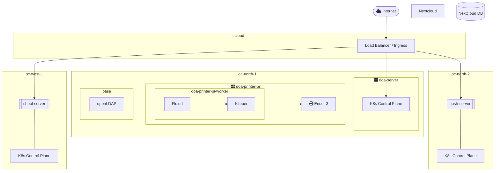

```mermaid
flowchart TD
    INTERNET(["fa:fa-cloud Internet"])

    NEXTCLOUD["Nextcloud"]
    NEXTCLOUD_DB[("Nextcloud DB")]

    INTERNET-->LB
    subgraph cloud
        LB["Load Balancer / Ingress"]
    end
    LB-->DOA_K8S_CONTROL_PLANE
    LB-->JOSH_SERVER
    LB-->SHEOL_SERVER

    subgraph oc-north-1
        subgraph doa-server [fa:fa-server doa-server]
            DOA_K8S_CONTROL_PLANE["K8s Control Plane"]
        end

        subgraph doa-printer-pi [fa:fa-server doa-printer-pi]
            subgraph doa-printer-pi-worker
                DOA_PRINTER_KLIPPER["Klipper"]
                DOA_PRINTER_FLUIDD["Fluidd"]

                DOA_PRINTER_FLUIDD--->DOA_PRINTER_KLIPPER
            end

            DOA_ENDER_3["fa:fa-print Ender 3"]

            DOA_PRINTER_KLIPPER--->DOA_ENDER_3
        end

        subgraph base
            OPENLDAP["openLDAP"]
        end
    end

    subgraph oc-north-2
        JOSH_SERVER[["josh-server"]]
        click JOSH_SERVER "https://home.gibbs.tk"

        JOSH_K8S_CONTROL_PLANE["K8s Control Plane"]

        JOSH_SERVER---JOSH_K8S_CONTROL_PLANE
    end

    subgraph oc-west-1
        SHEOL_SERVER[["sheol-server"]]
        click SHEOL_SERVER "https://home.powell.place"

        SHEOL_K8S_CONTROL_PLANE["K8s Control Plane"]

        SHEOL_SERVER---SHEOL_K8S_CONTROL_PLANE
    end
```
